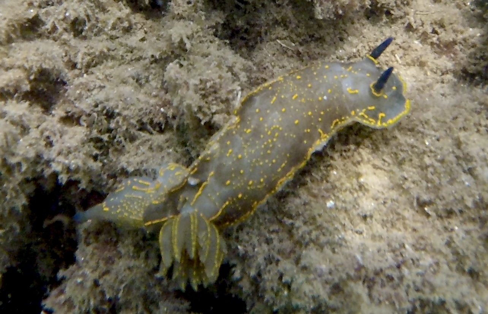

# Species Distribution Model - The Regal Sea Goddess

<p align="center">
  <br>
  <em>Regal Sea Goddess (<i>Felimare picta</i>) - Barcelona, Spain, 15 Aug 2025.<br>
  © 2025 Max Antson</em>
</p>

## App Demo

A demonstration of the species distribution model in the accessible area. Note that the final plot is still a work in progress - experiments in `src` shall help to finalise this.

https://github.com/user-attachments/assets/dd116b2d-f017-449e-be5a-172d0e663cd2

## Folder Structure

- The [data](./data/) folder contains all downloaded data sources. Note that these are not saved in the repository due to their large sizes.
  - Check the [README](./data/README.md) for a comprehensive list of data sources.
  - `bio_oracle` stored most environmental data, downloaded from [Bio-ORACLE](https://www.bio-oracle.org/downloads-to-email.php)
  - `gbif` stored presence and background data, downloaded from [GBIF](https://www.gbif.org/)
  - `ne_10m_coastline` stored coastline data to within 10m resolution, downloaded from [NaturalEarthData](https://www.naturalearthdata.com/downloads/10m-physical-vectors/)
- [environment.yml](./environment.yml) is here for reproducibility, to be able to run the source code with tested dependencies
- [deployment](./deployment/) contains deployment-related files. Three of them are generated as part of training in the notebook, and contains the script for creating a basic app based on the trained model.
  - [basic_app.py](./deployment/basic_app.py) is the `streamlit` app that can be run locally to interactively showcase the species distribution model results
  - [feature_names.json](./deployment/feature_names.json) is an output from the notebook so that the environmental variable names can be associated with the trained model
  - [model.json](./deployment/model.json) is the final XGBoost model
  - [threshold.txt](./deployment/threshold.txt) contains the optimised threshold used to assess whether the model prediction is to be classified as 'present' or 'absent'
- [img](./img/) contains any image data, either used for a few visuals within the notebook or saved as notebook outputs
  - [nudibranch_map.html](./img/nudibranch_map.html.zip) is generated in the last section of the notebook, showing the probability plot of where the nudibranch could be found, within its accessible area (to view, unzip it)
  - [regal_sea_goddess.jpg](./img/regal_sea_goddess.jpg) is my own image of a regal sea goddess
  - [sampling_bias_selection.jpg](./img/sampling_bias_selection.png) details how I selected the background dataset in GBIF
- The [notebooks](./notebooks/) folder contains the key initial exploration notebook - [species_distribution_pipeline.ipynb](./notebooks/species_distribution_pipeline.ipynb) - that runs through an entire ML pipeline from initial data processing to creating a local app based on a trained model. Note that `src` then refines this via hyperparameter tuning, proper testing, etc.
- [src](./src/) contains pipeline code to try out machine learning experiments with different configurations. This could include pre-processing the data differently, using different environmental variables, different hyperparameter configurations for the model, etc.
- [outputs](./outputs/) contains the outputs (e.g. results, interpretations) and configuration file of experiments tried by running the [src](./src/) code, to see the history of model development.

## Run notebook

1. Set up the `regal-sea-goddess` environment via `mamba env create --file environment.yml`
2. Open the notebook using the `regal-sea-goddess` environment
3. Download all needed data into the data folder as described in the notebook
4. Run all of the cells!

## Run app locally

First, unzip `img/nucibranch_map.html.zip` - it should give you a file `img/nudibranch_map.html`.

```bash
mamba activate regal-sea-goddess
cd deployment
streamlit run ./basic_app.py
```

## Future TODOs

- Improve distance calculations to take spherical nature of Earth into account. Right now the metres I use are stretched.
  - This will affect functions `filter_dataset_1_by_distance_to_dataset_2`, `spatially_thin`, `create_spatial_folds` and `split_train_and_test_by_distance`
  - Once the above is solved, try filtering regal sea goddess by distance to shore rather than by bathymetry (or as well as)
- Double-check if 'NaN' in bathymetry data means 'Land'. If not, improve accessible area filtering to filter out land using a different method.
- Improve filtering to keep more observations. A lot of people just state the nearest city that the nudibranch was found. If that city is close to shore, we could still include it and map it to the nearest point in the sea, for example.
- Learn what people generally do when it comes to not having a coordinate uncertainty for an observation. It'd be great to keep these but still apply some quality filtering, as there are so many observations that miss this piece of information.
- Save pre-processed data so we don't need to go through all the initial steps for every experiment run.
- Research - is spatial thinning necessary when using a background probability raster? And, if so, should the background sampled raster also be spatially thinned? What makes the most sense when modelling?
- More efficient joining of environment variables via `sjoin` - see function `load_all_environment_variables`
- Look into adding dynamic daily/monthly variables, rather than taking static 10 year averages
- Fix partial dependency plot labels
- In `src`, save visualisations along the way like in the notebook
- In `src`, save the cross validation data balances to see if each fold has a similar presence-absence split
- Improve cross validation splitting so there is a more even number of presence/absence points in each fold
- Save commit hash for each experiment run to be able to reconstruct the run if anything changes in the source code
